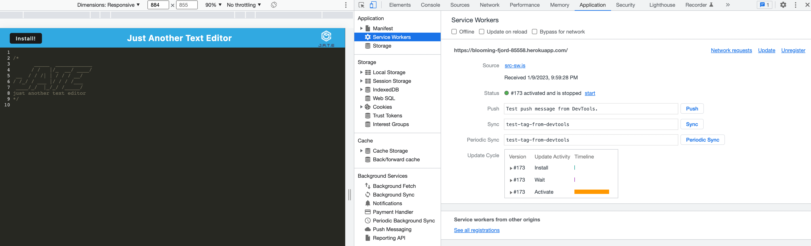
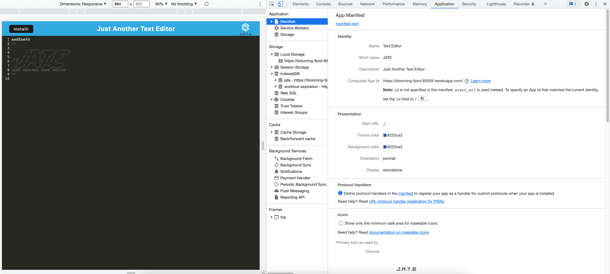
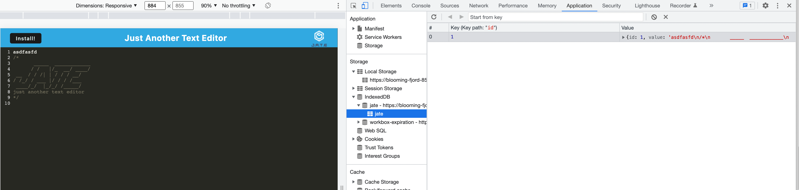

## PWA Text Editor

# Description
This application takes an existing text editor app and adds functionality for it to work as a PWA and function offline. This application is deployed through Heroku.

# User Story
AS A developer
I WANT to create notes or code snippets with or without an internet connection
SO THAT I can reliably retrieve them for later use

Screenshot of the Servie Workers active and Manifest in the Application tab of the dev tools

Example of data being saved locally with indexedDB

## Table of Contents   
* [Description](#description)
* [Installation](#installation)
* [Usage](#usage)
* [Contributing](#contributing)
* [Tests](#tests)
* [License](#license)
* [Questions](#questions)

## Installation 
use browswer on your computer or phone

## Usage
Travel to live application Heroku https://blooming-fjord-85558.herokuapp.com/ where you will be presented with a code/text editor. Any code or text you add will save automatically whenever you click off of the window. On refresh or revisit, the text is persistent and saved in IndexedDB.

## Contributing
No guidelines for this project

## Tests
No tests were done

## License
MIT

## Questions
GitHub: nelson92
nelson509@gmail.com
